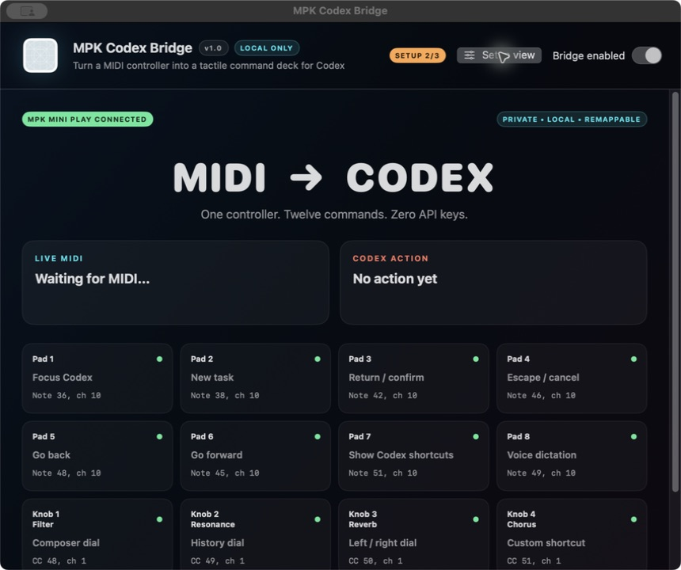
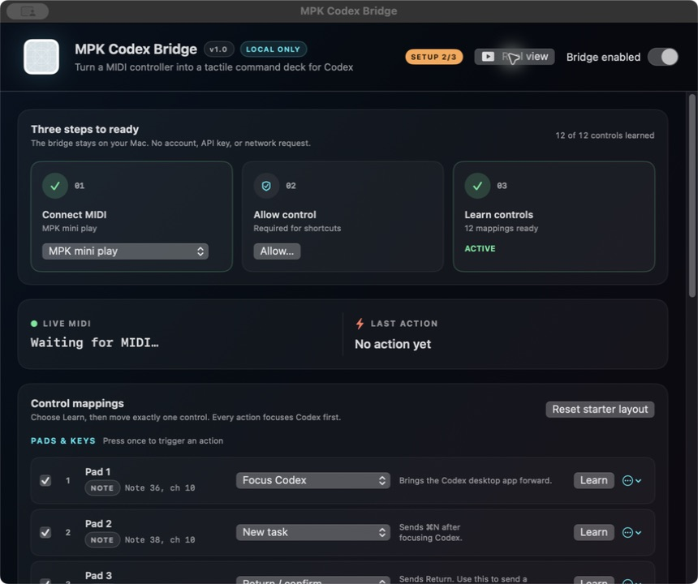

# MPK Codex Bridge

Turn an Akai MPK Mini Play into a programmable controller for the Codex
desktop app. Pads can open a task, confirm, cancel, navigate history, show
shortcuts, and toggle dictation. The four assignable knobs can become
directional controls.



## Download

[Download MPK Codex Bridge for macOS](https://github.com/kalaniandrez/mpk-codex-bridge/releases/latest/download/MPK-Codex-Bridge-macOS.zip)

Requires macOS 13 or newer and the
[Codex desktop app](https://openai.com/codex/). The release is a universal
Apple silicon and Intel build.

This independent open-source utility is not affiliated with or endorsed by
OpenAI or Akai Professional.

## Three-minute setup

1. Download and unzip the app, then drag **MPK Codex Bridge** to Applications.
2. On first launch, Control-click the app, choose **Open**, then confirm.
3. Connect the MPK directly by USB and choose it in the app.
4. Choose **Allow Accessibility**. Enable the bridge in **System Settings >
   Privacy & Security > Accessibility**.
5. Choose **Learn** beside a pad, then hit that pad once.
6. Turn **Internal Sounds off** on the MPK before learning the four knobs. Choose
   **Learn**, then turn exactly one knob.

See [the illustrated install notes](docs/INSTALL.md) if macOS blocks the first
launch or a knob does not register.



## Why the knobs sometimes appear broken

The MPK Mini Play's **Volume** knob controls its internal audio and does not send
an assignable MIDI CC message. Use the four knobs labeled **Filter**,
**Resonance**, **Reverb**, and **Chorus**.

With **Internal Sounds on**, those controls can affect the built-in synth
instead of reaching the Mac as the continuous MIDI messages this app needs.
Turn Internal Sounds off, then relearn each knob. Version 1.0 detects and clears
the common mistake where a piano note was learned into a knob slot.

## Starter layout

Nothing fires until you teach each row its physical MIDI control.

| MPK control | Starter action |
| --- | --- |
| Pad 1 | Focus Codex |
| Pad 2 | New task (`⌘N`) |
| Pad 3 | Return / confirm |
| Pad 4 | Escape / cancel |
| Pad 5 | Go back (`⌘[`) |
| Pad 6 | Go forward (`⌘]`) |
| Pad 7 | Open Codex shortcuts (`⌘/`) |
| Pad 8 | Codex voice dictation (Double Command) |
| Filter | Composer navigation (`Tab` / `Shift-Tab`) |
| Resonance | History (`⌘[` / `⌘]`) |
| Reverb | Left / right arrows |
| Chorus | Custom shortcut |

The custom shortcut parser supports `cmd`, `shift`, `option`/`alt`, `control`,
letters, digits, arrows, Return, Escape, Tab, Space, brackets, slash, and common
punctuation. Example: `cmd+shift+p`.

## What stays on your Mac

- CoreMIDI reads the connected controller.
- Accessibility sends keyboard shortcuts to Codex.
- Mappings are stored in the user's local Application Support folder.
- There are no accounts, analytics, telemetry, API keys, or network requests.

Read the short [privacy statement](docs/PRIVACY.md).

## Build from source

Requires Xcode Command Line Tools with Swift 6.

```bash
git clone https://github.com/kalaniandrez/mpk-codex-bridge.git
cd mpk-codex-bridge
./scripts/check.sh
./scripts/build-app.sh
open "dist/MPK Codex Bridge.app"
```

The dependency-free test runner covers MIDI parsing across packet boundaries,
button debouncing, knob direction, channel matching, shortcut parsing,
configuration round-tripping, and legacy knob-mapping migration.

## Scope

This recreates the keyboard-command-controller portion of Codex Micro. It does
not claim to reproduce Codex Micro's private hardware identity, live task-status
lights, or approval integration. MPK pad lighting remains under the keyboard's
own firmware control.

Licensed under the [MIT License](LICENSE).
